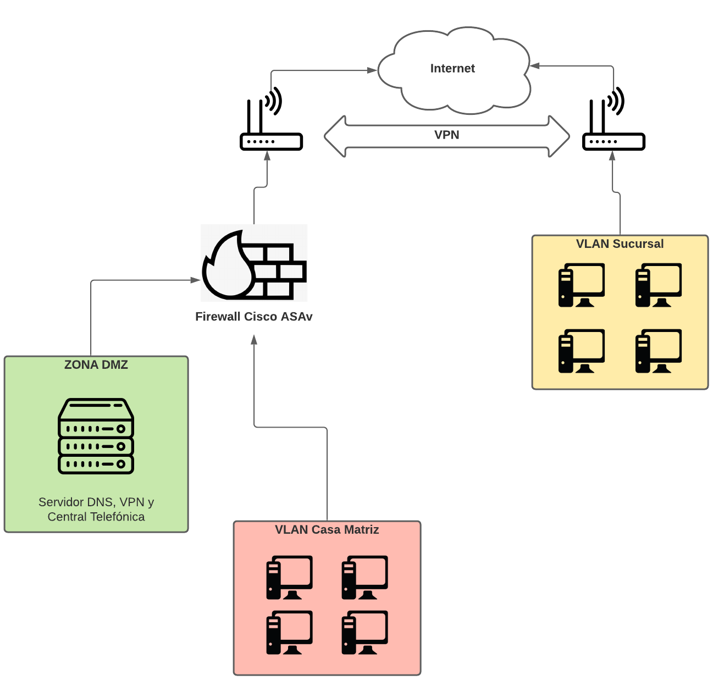

<h1>COS Grupo 03 África</h1>

<h2>Requisitos mínimos para la realización de este proyecto</h2>

- GNS3, versión 2.2.17 o superior.
- Docker
- Al menos 8gb de memoria ram (recomendado 16gb)
- De recomendación S.O. GNU/Linux
- VirtualBox VM

