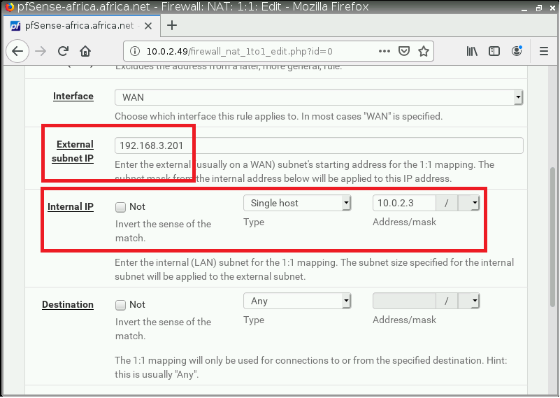

# Configuración de la topología al exterior
## Configuración de la zona DMZ
### Agregar Virtual IPs

Primeramente se procederán a crear dos Virtual IPs, que servirán para
que las personas de la red exterior (192.168.3.0/24) puedan encontrar
los servicios DNS y PBX. Para eso nos dirigiremos a Firewall -\> Virtual
IPs. Dentro de Virtual IPs presionamos el botón "Add" y nos aparecerá un
formulario.

En Tipo utilizamos CARP, la direccion que vamos a crear en este caso
será **192.168.3.200** y le agregamos una contraseña. Una vez terminado
guardamos con el botón "Save".


Para aplicar los cambios presionamos el botón Apply Changes


Se repetirán los pasos para la dirección **192.168.3.201/24**. Nos
aparecerá al final en la lista las siguientes Virtual IPs.


### Agregar entradas de NAT 1:1 para las IPs virtuales de PBX y DNS

Desde el menú de configuración de pfSense seleccionar Firewall -> NAT
-> 1:1. Una vez en el apartado de 1:1, para agregar una entrada
presionamos el botón "Add".

Una vez adentro del formulario, los unicos campos que se editarán será
la IP externa con la cual se configurará el 1:1 y la IP interna según
corresponda, en este caso la Virtual IP **192.168.3.200** irá enlazada
con la IP interna de FreePBX (**10.0.2.2**) y la Virtual IP
**192.168.3.201** con la IP interna de DNS (**10.0.2.3**). Una vez
configurado la entrada de 1:1, guardamos los cambios con el botón
"save".




Para realizar los cambios presionamos "Apply Changes" y nos aparecerá
una lista como la siguiente:


### Configuración de reglas para la salida de los puertos de FreePBX y DNS

Para configurar una regla para que se pueda comunicar un dispositivo
externo a la red local a través de la Virtual IP, primero tendremos que
establecer una regla. Para eso nos dirigiremos a Firewall-\>Rules-\>WAN
y agregaremos una nueva regla con los siguientes datos para el servidor
de FreePBX:


En este caso se ha creado una regla para la comunicación del puerto
5060-5061 (PJSIP) de la ip 10.0.2.2 por medio de TCP/UDP, también se
agregarán reglas para el puerto 80 TCP (HTTP), 5160-5161 TCP/UDP(SIP),
4569 TCP/UDP (IAX) y 10000-20000 UDP (RTP), estos puertos utilizados por
FreePBX, según la documentación:
[https://wiki.freepbx.org/display/PPS/Ports+used+on+your+PBX](https://wiki.freepbx.org/display/PPS/Ports+used+on+your+PBX)

Una vez creada la regla, se guardarán los cambios con "save" y
presionamos el botón "Apply Changes".

En el caso de las reglas para el servidor FreePBX quedarian de la
siguiente manera:


En el caso del servidor DNS, se necesitará agregar una regla para el
puerto 53 en TCP/UDP, la lista con todas las reglas quedaría de la
siguiente manera:


Podremos observar que se puede hacer acceso a los servicios desde IPs
externas:


## Configuración de portmap.io

[https://portmap.io/](https://portmap.io/) es un servicio de port
forwarding que nos ofrece de forma gratuita acceso mediante OpenVPN
configurado en el servidor de FreePBX, para empezar crearemos una cuenta
en portmap.io, una vez creada, se procederá a crear una conexión. Para
eso nos iremos al menú, seleccionamos la opción "Configuration" y
presionamos el botón "create new configuration".

Como se podrá observar en el formulario, nos pide que pongamos un
nombre, el tipo de conexión y el protocolo por el cual se conectará,
dejaremos todo tal cual y daremos clic en genrate.


Una vez generado, copiaremos la configuración de OpenVPN al servidor
FreePBX:


Instalamos OpenVPN con el siguiente comando:

```console
yum install -y openvpn
```

El resultado será parecido a esto:


Desde portmap.io, creamos una nueva regla de mapeo, desde el menú, en la
opción "mapping rules"


Damos clic en "Create new rule"


En este formulario, el campo a ingresar será el del puerto del servidor,
en este caso será el puerto IAX (4569 UDP), además, seleccionamos el
protocolo UDP y presionamos "Create".


Nos aparecerá el host en donde se encuentra el puerto IAX de nuestro
servidor FreePBX, desde el cual podremos iniciar sesión mediante Zoiper


Finalmente, para iniciar el redireccionamiento del puerto, iniciaremos
la vpn con el siguiente comando:

```console
openvpn portmap.ovpn
```

Finalmente, probamos el servidor especificando el puerto en donde se ha
redireccionado:


