# Configuración de topologías
## Topología Casa Matriz (Central)
La topología consta de dos servidores en la vlan DMZ (FreePBX y DNS), un firewall mediante pfSense, vpcs para simular hosts y un contenedor docker que simula un host con navegador web, además de una máquina virtual con Windows que simula un cliente con funcionamiento VoIP.


### VLSM Topología Casa Matriz
<table align="center">
		<tr>
			<th>Subred</th>
			<th>No. de Hosts</th>
			<th>Dir. de red</th>
			<th>Máscara</th>
			<th>Másc. (Decimal)</th>
			<th>Rango utilizable</th>
			<th>Broadcast</th>
		</tr>
		<tr>
			<td style="font-weight:bold">Atención al cliente</td>
			<td>126</td>
			<td>10.0.0.128</td>
			<td>/25</td>
			<td>255.255.255.128</td>
			<td>10.0.0.129 - 10.0.0.254</td>
			<td>10.0.0.255</td>
		</tr>		
		<tr>
			<td style="font-weight:bold">Soporte técnico</td>
			<td>126</td>
			<td>10.0.1.128</td>
			<td>/25</td>
			<td>255.255.255.128</td>
			<td>10.0.1.129 - 10.0.1.254</td>
			<td>10.0.1.255</td>
		</tr>		
		<tr>
			<td style="font-weight:bold">Recursos Humanos</td>
			<td>126</td>
			<td>10.0.1.0</td>
			<td>/25</td>
			<td>255.255.255.128</td>
			<td>10.0.1.1 - 10.0.1.126</td>
			<td>10.0.1.127</td>
		</tr>		
		<tr>
			<td style="font-weight:bold">Administración financiera</td>
			<td>126</td>
			<td>10.0.0.0</td>
			<td>/25</td>
			<td>255.255.255.128</td>
			<td>10.0.0.1 - 10.0.0.126</td>
			<td>10.0.0.127</td>
		</tr>		
		<tr>
			<td style="font-weight:bold">DMZ</td>
			<td>30</td>
			<td>10.0.2.0</td>
			<td>/27</td>
			<td>255.255.255.224</td>
			<td>10.0.2.1 - 10.0.2.30</td>
			<td>10.0.2.31</td>
		</tr>		
		<tr>
			<td style="font-weight:bold">Casa Matriz</td>
			<td>14</td>
			<td>10.0.2.32</td>
			<td>/28</td>
			<td>255.255.255.240</td>
			<td>10.0.2.33 - 10.0.2.46</td>
			<td>10.0.2.47</td>
		</tr>		
		<tr>
			<td style="font-weight:bold">pfSense</td>
			<td>2</td>
			<td>10.0.2.48</td>
			<td>/30</td>
			<td>255.255.255.252</td>
			<td>10.0.2.49 - 10.0.2.50</td>
			<td>10.0.2.51</td>
		</tr>		
	</table>

### Configuración de las máquinas virtuales (FreePBX, DNS, pfSense y cliente Windows)
Las siguientes configuraciones fueron realizadas desde VirtualBox:
- Servidor FreePBX
    - Memoria ram: 1gb
- Adaptadores de red: 1
    - Hilos del CPU: 1
- Servidor DNS (Debian)
    - Memoria ram: 512mb
    - Adaptadores de red: 1
    - Hilos del CPU: 1
- pfSense
    - Memoria ram: 512mb
    - Adaptadores de red: 4
    - Hilos del CPU: 1

Todas las configuraciones se realizaron con un disco duro virtual de 8gb cada uno.

Para poder agregar una máquina virtual de virtualbox a GNS3 primero hay que entrar a la ventana de preferencias (Edit -> Preferences ó Ctrl+Shift+P). Una vez adentro se dirigirá al apartado VirtualBox VMs.
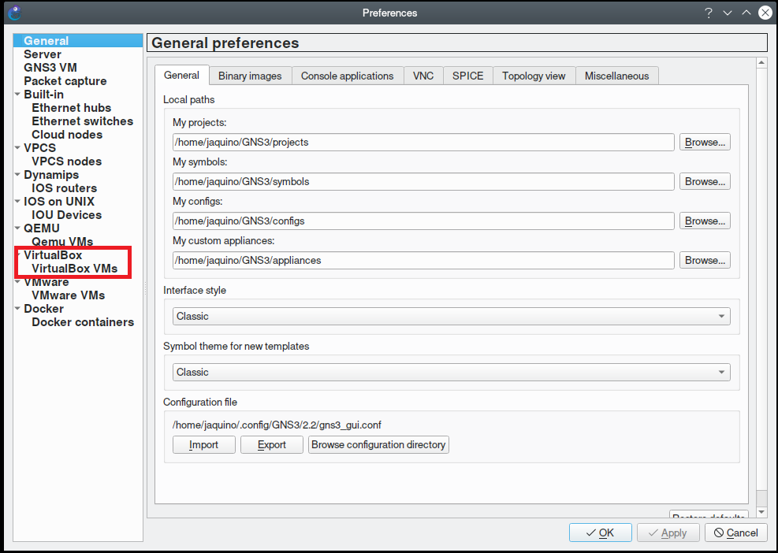
Seleccionamos el botón “New”
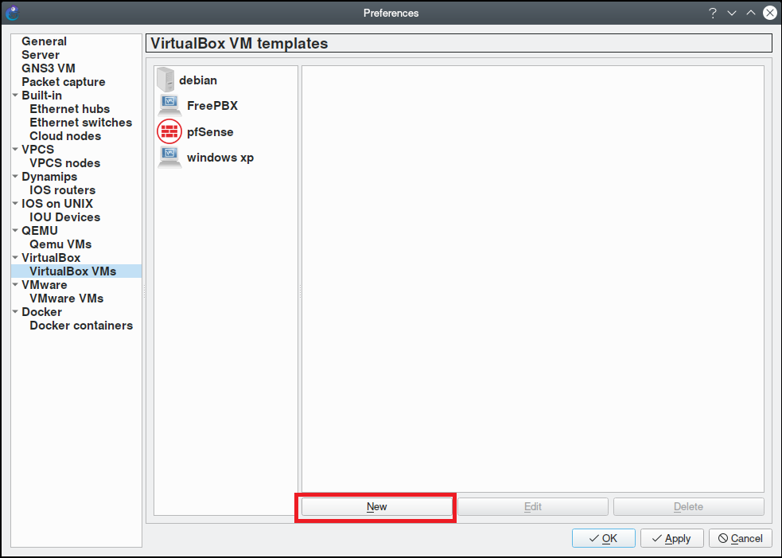
Seleccionamos “Run this VirtualBox VM on my local computer” (Correr esta máquina virtual de Virtualbox en mi computadora local) y presionamos “Next”.
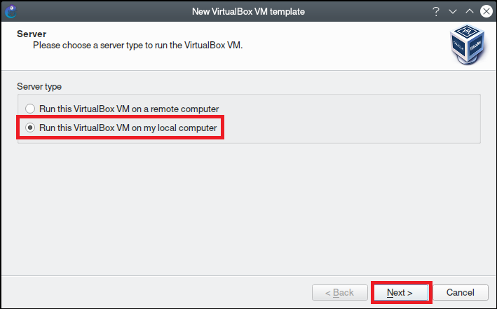
Seleccionamos la máquina virtual que deseamos agregar en GNS3 y presionamos Finalizar. Al salir nos aparecerá de nuevo la ventana de preferencias y presionamos “OK”.
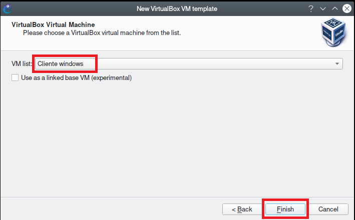

Una vez realizado podremos observar que la máquina virtual se encuentra como un dispositivo para agregar a nuestra topología. Para poder agregarla a nuestra topología antes tenemos que editar una opción. Para esto damos clic derecho en nuestra máquina virtual y seleccionamos “Configure template”
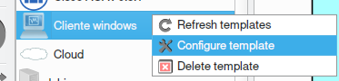

Dentro de la ventana de configuración, seleccionaremos la pestaña “Network”. Seleccionamos la casilla que dice “Allow GNS3 to use any configured VirtualBox adapter”. En el caso que se esté configurando la máquina virtual de pfSense, también se tiene que agregar los adaptadores necesarios, desde la casilla marcada con verde (en nuestro caso, seleccionaremos 4).
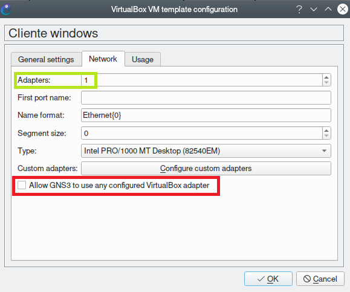

Presionamos OK y la máquina virtual ya estará lista para incorporarse y ser conectada en la topología de GNS3.

### Configuración de contenedor Docker (gns3-webterm)
El contenedor gns3-webterm simula un host con capacidades de navegador, se recomienda el uso de este contenedor frente a una máquina virtual si se planea utilizar solamente para conectarse a un servidor web, ya sea localmente o en internet.
Para instalar el contenedor realizaremos los siguientes comandos (en el caso que se tenga instalado GNS3 en una partición de Linux con docker instalado y configurado correctamente).

```console
docker pull gns3/webterm
```

Una vez completada la instalación del contenedor, desde la ventana de preferencias de GNS3, seleccionaremos el apartado “Docker containers”. Adentro de este apartado seleccionaremos el botón “New”.
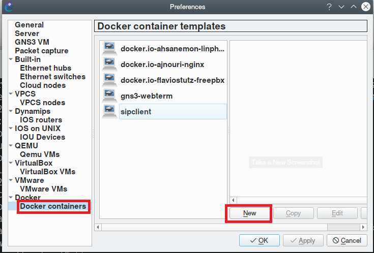

Una vez adentro del asistente de Docker, seleccionaremos la opción donde hayamos instalado el contenedor. En este caso, se instaló en un servidor gns3 aparte, por lo cual seleccionaré “run this docker container on a remote computer”. Una vez seleccionada la opción daremos clic en “Next”.
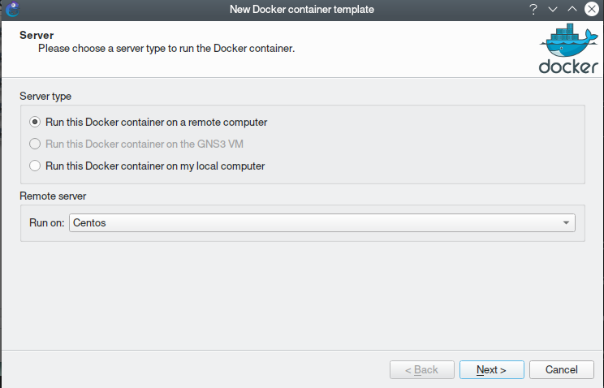

Seleccionamos “existing image” y de la lista, seleccionamos el contenedor a ingresar en gns3. En este caso se seleccionó el contenedor “docker.io/gns3/wenterm:latest”. Una vez seleccionado el contenedor presionamos “Next”.
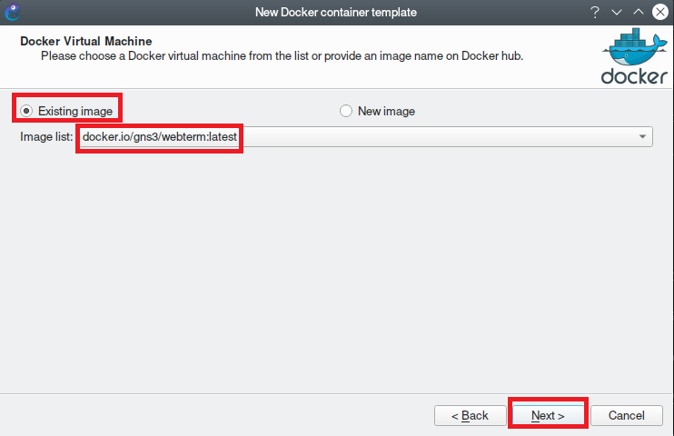

Asignamos un nombre a nuestro contenedor y presionamos “Next” para continuar.
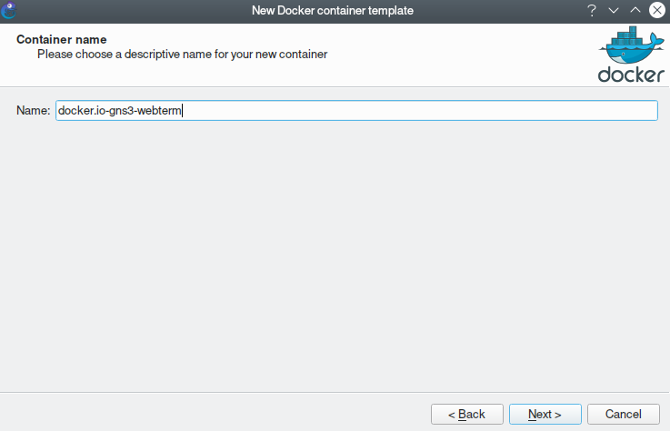

Ingresamos el número de adaptadores de red que queramos utilizar o dejamos el número por defecto (1). Presionamos “next” para continuar.

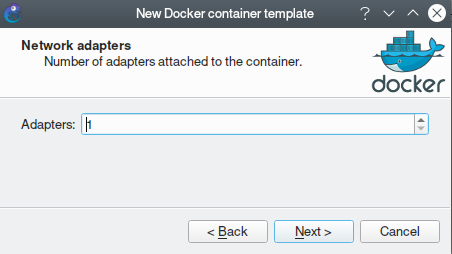

Ingresamos un comando que se quiera realizar una vez el contenedor se inicialice o dejamos en blanco y presionamos “next” para continuar.

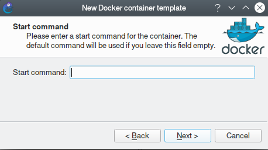

Seleccionamos la manera de ingresar al contenedor, se selecciona VNC para poder tener un entorno gráfico debido al uso de un navegador. Seleccionamos “next” para continuar.
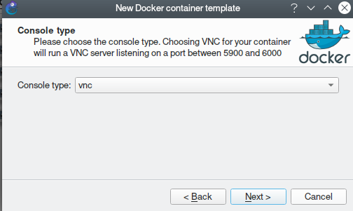

Ingresamos las variables de entorno a utilizar o dejamos en blanco si no se desea poner alguna. Presionamos “finish” para finalizar el asistente.

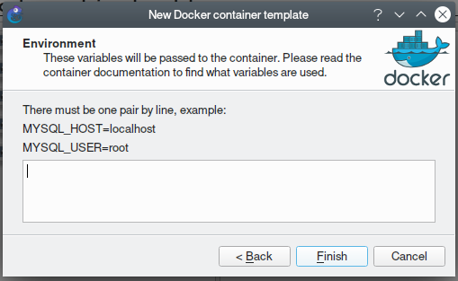

Una vez terminado el asistente, podremos ver que el contenedor docker fue agregado correctamente. Para efectos de este caso, todos los webterm se conectarán mediante DHCP, por lo tanto se tiene que editar un dato más, así que cuando se agregue un webterm a la topología, se realizará la siguiente configuración. Primero daremos clic derecho al dispositivo y seleccionaremos la opción “Edit Config”

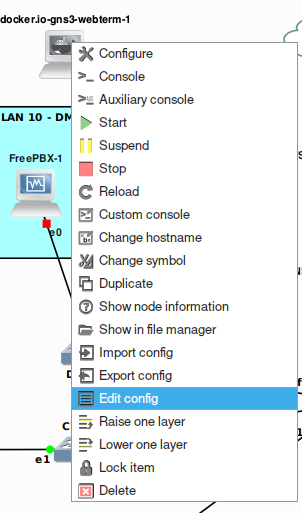

Dentro de esta configuración, se descomentarán las últimas dos líneas, necesarias para configurar el dispositivo con DHCP. una vez terminado daremos clic en “Save”.
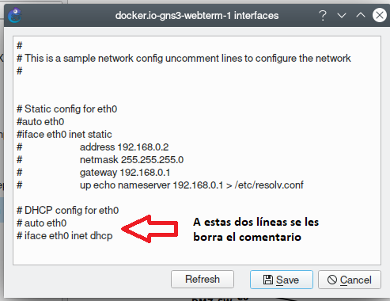

## Topología Sucursales
La topoplogía de las sucursales cuenta con un router c3725 conectado a internet, además de un switch y por motivos de demostración por el momento solo cuenta con un host.

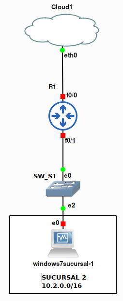

El Router R1 realiza un nateo para que las máquinas de la sucursal puedan conectarse a internet, además que mediante la interfaz f0/0 su dirección IP está configurada mediante DHCP, asimismo, se ha configurado un servicio DHCP para proveer a los hosts de la subred 10.X.0.0/16 (donde X puede ser 1 o 2, dependiendo de la sucursal, para ejemplos de este tutorial utilizaremos el octeto 2 que corresponde a la sucursal n° 2).

Para poder configurar la IP mediante DHCP en la interfaz f0/0 realizaremos los siguientes comandos: 

```
R1#conf t
R1(config)#in f0/0
R1(config-if)#ip nat outside
R1(config-if)#ip add dhcp
R1(config-if)#no shut
```
Una vez configurada la interfaz f0/0, procederemos a configurar la interfaz f0/1, con la dirección de red 10.2.0.0/16:

```
R1(config-if)#in f0/1
R1(config-if)#ip add 10.2.0.1 255.255.0.0
R1(config-if)#ip nat inside
R1(config-if)#no shut
R1(config-if)#exit
```

A  continuación vamos a configurar el servicio NAT, este permitirá tener acceso a Internet a los equipos que se encuentran dentro de nuestra red interna del router. En este caso se usará la variante PAT (Port Address Translation), ya que solo se cuenta con una IP pública y la traducción se hará mediante la asignación de un puerto a cada petición de cada equipo de la red interna.

Para configurar el servicio PAT dentro del router, se deberá realizar los sisguientes comandos dentro de la consola de comunicación.

```
R1(config)#access-list 1 permit 10.2.0.0 0.0.255.255
R1(config)#ip nat inside source list 1 interface f0/0 overload
```

Y finalmente para configurar el servicio de DHCP para los hosts de la subred 10.2.0.0/16:

```
R1(config)#ip dhcp pool sucursal2
R1(dhcp-config)#network 10.2.0.0 255.255.0.0
R1(dhcp-config)#dns-server 1.1.1.1
R1(dhcp-config)#default-router 10.2.0.1
R1(dhcp-config)#exit
```
Y podremos corroborar en nuestro host windows que se ha configurado correctamente el servicio DHCP y NAT en el router.

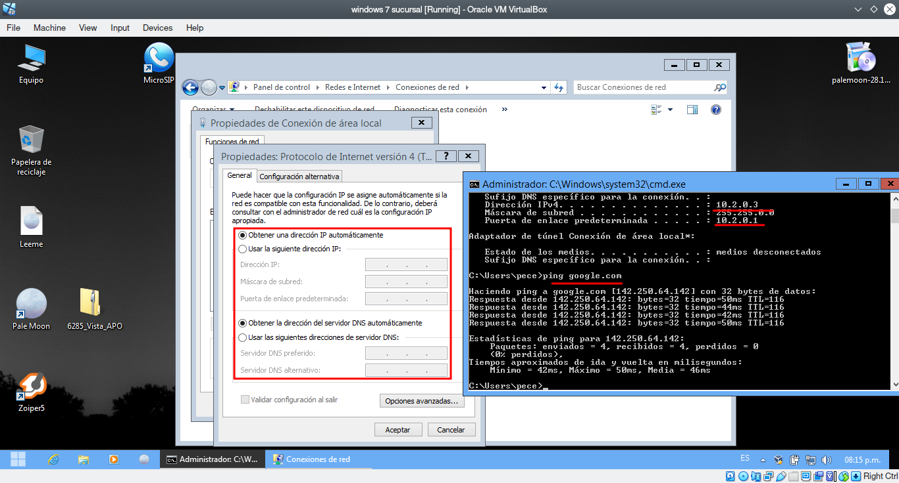