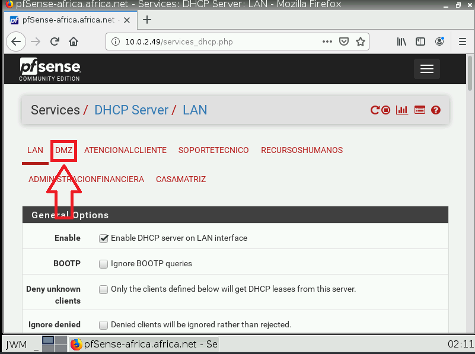
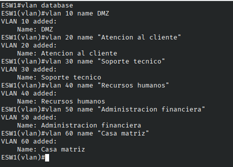
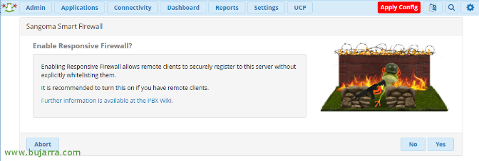
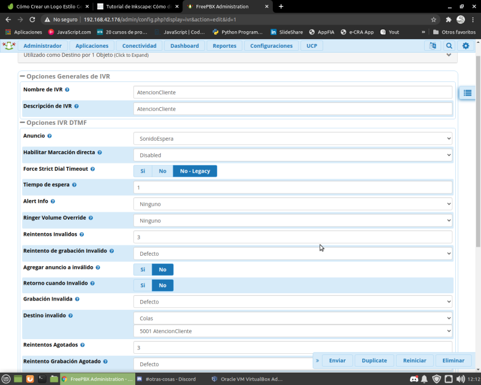
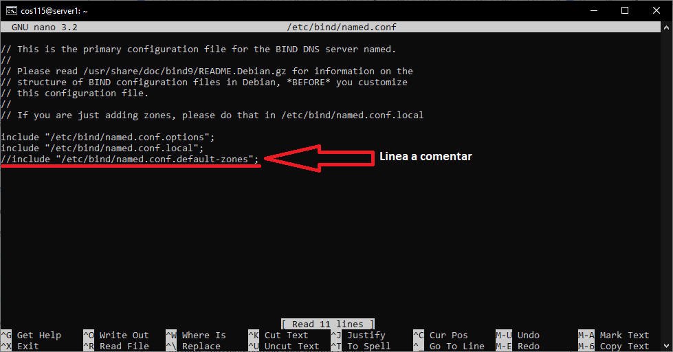

# Instalación y configuración de servidores

## Instalación de pfSense

(De wikipedia) pfSense es una distribución pfSense es una distribución
personalizada de FreeBSD adaptado para su uso como Firewall y router. Se
caracteriza por ser de código abierto, puede ser instalado en una gran
variedad de ordenadores, y además cuenta con una interfaz web sencilla
para su configuración.

Para descargar pfSense se ingresa a su página oficial en
[https://www.pfsense.org/](https://www.pfsense.org/), y
seleccionamos la sección "Download"


En el apartado "Select Image to Download", seleccionaremos la
arquitectura amd64, y el método de instalación "CD Image (ISO)
Installer". Damos clic en "Download" para descargar finalmente.


Una vez descargada la imagen se procede a montar en la máquina virtual
configurada para pfSense. Al iniciar la máquina nos aparecerá un menú,
al cual solo presionaremos "enter" o la opción 1.


Una vez cargado el instalador nos aparecerá el siguiente mensaje, al
cual solo presionamos "enter" para aceptar.


Presionamos enter en la opción "install pfSense".


Seleccionamos la opción de teclado "Latin America (accent keys)" y
presionamos enter. Seleccionamos después la opción "Continue with
latinamerican.acc.kbd keymap" y presiona enter.


Seleccionamos la opción "Auto (UFS)" y presionamos enter.


Esperamos a que el instalador realice el formateo e instalación. Nos
saldrá un mensaje preguntando si queremos ingresar a la consola antes de
reiniciar la máquina virtual. Seleccionaremos no y daremos enter para
continuar.


Presionamos enter para reiniciar.


## Configuración de pfSense

### Configuración de la interfaz LAN

Una vez instalado e iniciado en el menu principal de pfSense, podremos
observar que la ip de la interfaz WAN ha sido configurada correctamente
mediante DHCP, para asignar la IP correcta en la interfaz LAN,
seleccionaremos la opción 2 (set interfaces IP address) y presionaremos
enter para continuar.


Seleccionamos la opción 2 que corresponde a la interfaz lan.


Ingresamos la nueva dirección IP de la interfaz. Según la asignación de
direcciones pondremos 10.0.2.49.


Ingresamos el prefijo de la máscara de red, en este caso será 30.


Presionamos enter para seguir.


Presionamos nuevamente enter para seguir.


El asistente nos preguntará si queremos configurar un server DHCP en la
interfaz, seleccionamos que si ingresando "y" y presionando enter.


El asistente nos pedirá el rango de IPs a seleccionar en el servidor
DHCP, como solo nos queda una dirección disponible (10.0.2.50) la
ingresamos tanto en la dirección de inicio como la del final y
presionamos enter para continuar.


Seleccionamos que si ingresando "y" y presionamos enter.


Finalmente, nos aparecerá que la dirección de la interfaz LAN se
configuró correctamente, además de la url de la interfaz web para poder
seguir configurando tanto las reglas del firewall como las VLAN.
Presionamos enter para continuar.

### Configuración de la interfaz web de administrador

Para ingresar a la interfaz web se utilizará el contenedor docker del
webterm, configurado anteriormente para funcionar con dhcp. iniciamos el
contenedor y abrimos el navegador. Una vez abierto el navegador
ingresamos la url de la interfaz web (en este caso, 10.0.2.49). Nos
aparecerá el inicio de sesión, por defecto el usuario es "admin" y la
contraseña "pfsense".


Una vez iniciamos sesión, nos aparecerá el asistente de configuración de
pfSense, presionamos "next" para continuar.


En la configuración básica, llenaremos los campos de acuerdo a lo
siguiente, en hostname utilizaremos "pfSense-africa", en el dominio
"africa.net", y servidores dns 1.1.1.1 y 1.0.0.1, respectivamente.
Presionamos "next" para continuar.


En el apartado de configuración del Servidor de hora, dejaremos el
hostname tal y como está, la zona la cambiaremos a GMT-6, presionamos
next para continuar.


En las opciones de la WAN, dejamos todo como está, con la diferencia que
desmarcamos las últimas dos opciones, presionamos next para continuar.


En las opciones de LAN lo dejamos tal cual está y presionamos next para
continuar.


Ingresamos la contraseña deseada para el administrador del WebGUI, y
presionamos next para continuar.


Finalmente, presionamos "Reload" para cargar los cambios de pfSense.
Esperamos que los cambios se realicen. Seguido nos aparecerá un mensaje
que el asistente se completó correctamente y presionamos "finish" para
volver a la interfaz de administrador.


### Configuración de las VLAN

Para crear las VLAN desde pfSense, desde el menu principal
seleccionaremos Interfaces -> Assignments.


Una vez dentro del menu de asignaciones, seleccionaremos la pestaña
"VLANs".


Una vez dentro de VLANs, para crear una VLAN le daremos clic al botón
"Add".


Una vez adentro, en el formulario se llenará de acuerdo a las VLAN que
tengamos, en este caso se llenó de acuerdo a la VLAN 10 (DMZ), cabe
destacar que la interfaz a la que se le configurará la VLAN es la em1,
equivalente a la interfaz LAN, donde está conectada nuestra red interna.
Le damos Save para guardar los cambios y repetimos este proceso para
todas las VLAN de nuestra red.


Una vez finalizado con todas las VLAN, la lista se verá asi:


Para habilitar las interfaces, volveremos al apartado
Interfaces->Assignments, en este se encuentra en la lista una opcion
que dice "Available network ports", seleccionamos de la lista la VLAN a
agregar y para continuar presionamos "Add".


Una vez finalizado con todas las vlan, presionamos el botón "save", nos
aparecerá una lista parecida a esta:


Para asignar la dirección IP de cada una de las VLAN, primeramente se
tiene que hacer clic en el título de cada Interfaz, por ejemplo en el
caso de la VLAN 10 será OTP1. Nos aparecerá un formulario como el
siguiente:


Como se puede observar, ya se hicieron algunos cambios, habilitamos la
interfaz haciendo clic en "enable interface", cambiamos el nombre por
uno más descriptivo, como DMZ y también cambiamos el tipo de
configuración IPv4 a estática. En el caso de la IP estática, siguiendo
el formulario se encontrará un apartado para ingresarla, en el caso de
nuestra topología, la VLAN de DMZ contiene la dirección de red
10.0.2.0/27, por lo cual se configurará la IP de la interfaz como
10.0.2.1/27. Presionamos "Save" para guardar los cambios.


Finalmente, para aplicar los cambios daremos clic en el botón "apply
changes". Este proceso se repetirá para todas las VLAN de nuestra
topología.


Para configurar el servidor DHCP de las subinterfaces de la VLAN, desde
el menú principal seleccionaremos Services -\> DHCP server.


Una vez en el apartado de DHCP server, seleccionamos la subinterfaz a
configurarle el servicio, en este caso seleccionaremos DMZ.



En la configuración de DHCP de la subinterfaz DMZ, primero que nada
habilitamos el servicio en la opción marcada.


En el apartado del rango del servicio, especificamos desde que dirección
hasta que dirección podemos asignarle a los hosts de dicha vlan, en el
caso de la DMZ, será desde la dirección 10.0.2.2 hasta la 10.0.2.30


Finalmente, en las opciones de DNS configuramos (temporalmente) como DNS
primario 1.1.1.1 y DNS secundario 1.0.0.1. Temporalmente ya que una vez
configurado el server DNS que resuelva los dominios de africa.net esta
dirección es la que se utilizará en todos los servicios DHCP de las
VLANs. Una vez configurado damos clic en "save" para guardar los
cambios. Estos cambios se harán en el resto de las VLAN.

Finalmente, se creará una regla en el Firewall para permitirles la
comunicación, para eso nos vamos a Firewall -> Rules


Una vez adentro, seleccionamos la pestaña de la VLAN a la que le
queramos agregar una nueva regla. En este caso se mostrará solo para la
zona DMZ pero se aplicará en el resto de las VLAN.


Una vez dentro, se selecciona la opción "Add" para agregar una nueva
regla.


Una vez dentro del formulario del firewall, el campo a editar será el de
protocolo, lo cambiaremos a la opción "Any". Una vez hecho esto, se
guardará con el botón "save".


Para aplicar los cambios del firewall, presionamos el botón apply
changes.


## Configuración de las VLAN en el EtherSwitch

Una vez configurada las VLAN con sus reglas en el firewall, primero se
agregarán las definiciones de las VLAN a la base de datos del ESW,
mediante los siguientes comandos:



Configuramos la interfaz f1/6 en modo troncal para comunicarse con el
firewall pfSense:


Configuramos las demás interfaces para establecer el acceso a las
distintas vlan, primero empezaremos con la VLAN 10, cuya interfaz es la
f1/5:


La configuración del EtherSwitch con las otras vlan se utilizarian los
mismos comandos, cambiando solamente la interfaz y la vlan que
accesaria:
```
interface FastEthernet1/0
switchport access vlan 60 
switchport mode access    
                          
!                         
                          
interface FastEthernet1/1 
switchport access vlan 20    
switchport mode access    
                          
!                         
                          
interface FastEthernet1/2  
switchport access vlan 30           
switchport mode access    
                          
!                                      
interface FastEthernet1/3             
switchport access vlan 40                 
switchport mode access    
                          
!                                             
interface FastEthernet1/4                     
switchport access vlan 50                
switchport mode access  
```


Revisamos que todas las conexiones fueron realizadas correctamente:


Corroboramos que esté sirviendo la configuración tanto de la vlan como
del DHCP mediante una VPCS:


También al probar ping de una vlan a la otra:


Guardamos la configuración actual para que se cargue cada vez que el
switch se encienda.


## Instalación y configuración de FreePBX

Pasos para la instalación de freepbx.

- Se busca el sitio oficial de asterisk, y se da clic en descargar.


- Luego se muestra la imagen de freepbx con la versión estable de asterisk (LTS), se da clic en descargar.


- Aparece un formulario, que solicita nuestros datos personales.


- Una vez llenado el formulario y enviado, se nos permitirá descargar la imagen de freepbx.

- Teniendo previamente una maquina virtual con 1gb de memoria ram (mínimo), junto con el almacenamiento de 8 GB y un procesador. Se procede a montar la imagen.

- Habiendo iniciado la maquina virtual, se elige la instalación de la versión de freepbx con la versión lts de asterisk, y se define la instalación de forma gráfica.


-   Se procede a configurar el teclado, la zona horaria, el idioma, las tarjetas de red, asi como del dominio y la contraseña del usuario (root), el instalador por defecto configurará las contraseñas de asterisk y otros servicios. Esta instalación demora entre 1 a 3 horas.


- Luego que termine la instalación, reiniciamos y vemos que se ha iniciado normalmente.

- Escribimos la dirección ip que freepbx nos muestra en la consola de nuestra maquina virtual para acceder al menú principal, en nuestro navegador.

- Se nos muestra una pagina donde se nos solicita definir un administrador de los servicios, junto con su correo.


- Al terminar de configurar la cuenta de usuario administrador se mostrara el siguiente panel.


- Nos logueamos como administrador.


- Se nos dará la bienvenida y se pedirá establecer el lenguaje y zona horaria.


- Después se pide configurar el firewall, se debe realizar cada pasao para tener un buen funcionamiento de freepbx. Le damos en continuar.


- Le damos en next (manteniendo la configuración sugerida) y a yes a todo.





- Una vez terminado, se nos mostrara la pagina principal como la siguiente. Donde vemos: los clientes conectados, los servicios funcionando, la información del trafico en las troncales, y las advertencias de errores o notificaciones de éxito.


Para configurar las cuentas pjsip:

- primero se debe de ir a configuraciones, elegir la opciónConfiguraciones Asterisk SIP.


- Establecer la dirección externa (para la comunicación del servidor voip con el exterior) y definir la red local.


- Se guardan los cambios y luego clic en el botón rojo "aplicar configuración" que es de color rojo y aparece en la parte superior.

- Luego se elige el menú aplicaciones y se elije la opción de extensiones.


- Le damos a crear nueva extensión y elegimos una extensión chan_pjsip.


- Aparecerá un formulario donde debe definirse el numero de la extensión, el cid, el nombre y la contraseña (secrect), se llena cada campo como lo siguiente.


- Luego en la configuración Advanced se cambia a automático la función de transporte.


- Le damos en enviar y luego en aplicar configuración.

### Configuración de una cola telefónica (call center):

- Como primer paso debe de cargarse las grabaciones a utilizar, esto a través del menú aplicación en la opción grabaciones del sistema.

- Se busca la opción añadir grabación (como mínimo formato mp3).

- En el formulario se debe definir el nombre que tendrá la grabación dentro de freepbx, junto con una breve descripción y el archivo de audio, así como también la definición de los formatos a los cuales freepbx debe convertilo (si no se elige al menos uno, el archivo de audio no se podrá usar adecuadamente). Este proceso se realizo dos veces, para definir el mensaje para el horario labora y las horas no laborales.


- Ahora se procede a seleccionar en el menú aplicaciones, la opción colas.

- Se elige la opción añadir colas.

- Aparece un formulario donde se debe definir el identificador de la cola, el nombre, descripción y la extensión (de una cuenta voip) que se utilizara para atender las llamadas, así como la marcación que deberá usarse para contactar al agente de atención a la cola.


- Luego se debe crear un anuncio, esto a través de aplicaciones en la opción anuncios.

- Se define el anuncio, el nombre y otros elementos para que funcione correctamente.


- Teniendo el anuncio se crea un ivr, a través de aplicaciones > ivr.




- Se crea un grupo horario para establecer la hora del la grabación laboral. Esto en aplicaciones \> grupos horarios.

- Se define las horas iniciales y finales por día, los días de la semana, el inicio y fin del año laboral.


- Después se establece las condiciones horarias para tener control de que grabación suena o no.


- Teniendo todo lo anterior, se procede a definir una troncal. Para ello se accede al menu conectividad y se elige la opción Lineas.


- Se utiliza como cid el numero 0 seguido de la extensión a usar. Se define la contraseña y otros parámetros importantes. Como la ip del servidor voip y del puerto a usar.


- Luego siempre en conectividad se crea la ruta entrante, con lo cual debe elaborarse así.


- Ya teniendo la linea y la ruta entrante, se crea la ruta saliente. La cual debe de contener los siguientes parámetros.


Ya con eso tendremos nuestra cola de llamadas telefónicas para call
center

Para configurar la cuenta sip en nuestros dispositivos:

- Vamos a la tienda de aplicaciones, en este caso google play, y buscamos la aplicación zoiper.

- Le damos a ver, luego a instalar, le damos los permisos para que funcione y comienza la instalación.

- Luego de instalar zoiper, le damos en lanzar aplicación.

- Procedemos a aceptar los términos y servicios, apareciendo la ventana para ingresar nuestra cuenta sip.

- Agregamos la extensión seguida de @, del dominio de nuestro servidor voip y del puerto que se utiliza para la comunicación. Y la contraseña para el usuario.

- En el siguiente formulario se pide agregar el dominio, se deja el que se muestra en el campo.

- En la parte de proxy lo dejamos vacio y en la opción anywere.

- Luego zoiper identificara el protocolo utilizado por la cuenta sip.

- Al acabar e identificar el protocolo, se pulsa el botón finalizar.

- Zoiper realizara la verificación de la cuenta, una vez lo verifica debe estar marcado con luz verde como se muestra, y listo tenemos la cuenta sip para nuestra central telefónica.

## Instalación y configuración del servidor DNS (debian)

Para poder instalar y configurar el servidor DNS, se tiene como
requisito haber instalado debian en la máquina virtual, si no se tiene
instalado se puede guiar en el siguiente enlace:
[https://www.howtoforge.com/tutorial/debian-minimal-server/](https://www.howtoforge.com/tutorial/debian-minimal-server/)

Una vez instalado e inicializado, instalamos e inicializamos el servicio
DNS bind9 con el siguiente comando:

```console
sudo apt install bind9     
                           
sudo systemctl start bind9 
                           
sudo systemctl enable bind9
```

El último comando sirve para establecer que bind9 se inicie desde el
arranque. Una vez hecho esto configuraremos una lista de acceso para las
subredes internas, editamos el archivo /etc/bind/named.conf.local con el
siguiente comando:

```console
sudo nano /etc/bind/named.conf.local
```

Y agregamos el siguiente fragmento:

```
acl internals{
    127.0.0.1/8; 
    10.0.2.0/27; 
    10.0.0.0/25;  
    10.0.0.128/25;
    10.0.1.0/25;
    10.0.1.128/25;
    10.0.2.32/28;
    10.0.2.48/30;
}             
```

Si tuviéramos más redes internas, podríamos agregarlas allí. No
definimos lo externo porque todo lo que no es interno es externo. Si se
desea, se puede definir conjuntos de diferentes externos si se desea
ofrecer contenido diferente a diferentes partes de Internet.

Agregamos las declaraciones de zona en <code>/etc/bind/named.conf.local</code> con:

```
view "interno" {
    match-clients { internals; };
    recursion yes;
    zone "africa.net"{
        type master;
        file "/etc/bind/internals/db.africa.net";
    };
    include "/etc/bind/named.conf.default-zones";     
};

view "externo" {
    match-clients { any; };
    recursion no;
    zone "africa.net" {
        type master;
        file "/etc/bind/externals/db.africa.net";
    };
    include "/etc/bind/named.conf.default-zones";                                    
};                                        
```

De esta forma, las peticiones externas no verán la declaración de zonas
internas. Asimismo, editamos el archivo /etc/bind/named.conf y
comentamos la linea **include "/etc/bind/named.conf.default-zones";**
debido a que dicha declaración de zonas se realiza desde una vista
siempre. La anterior configuración quedaria asi:



Finalmente, creamos las carpetas de las configuraciones de zonas interna
y externa con los siguientes comandos:

```console
sudo mkdir /etc/bind/externals -p
sudo mkdir /etc/bind/internals -p
```

Creamos la declaración de zona interna con el siguiente comando:
```console
sudo nano /etc/bind/internals/db.africa.net
```

Ingresamos el siguiente bloque en la declaración:
```
; africa.net
$TTL    604800
@       IN      SOA     ns1.africa.net. root.africa.net. (
                     2006020201 ; Serial
                         604800 ; Refresh
                          86400 ; Retry
                        2419200 ; Expire
                         604800); Negative Cache TTL
;
@       IN      NS      ns1
        IN      A       10.0.2.3
ns1     IN      A       10.0.2.3
pbx     IN      A       10.0.2.2
```

Asimismo, creamos la declaracion de zona externa con el siguiente
comando:

```console
sudo nano /etc/bind/externals/db.africa.net
```

E ingresamos el siguiente bloque en la declaración:

```
; africa.net
$TTL    604800
@       IN      SOA     ns1.africa.net. root.africa.net. (
                     2006020201 ; Serial
                         604800 ; Refresh
                          86400 ; Retry
                        2419200 ; Expire
                         604800); Negative Cache TTL
;
@       IN      NS      ns1
        IN      A       192.168.3.201
ns1     IN      A       192.168.3.201
pbx     IN      A       192.168.3.200
```

Finalmente, reiniciamos el servicio de bind9 con el siguiente comando:

```console
sudo service bind9 restart
```

Y podemos probar la configuración del DNS desde un host de la red
interna:

